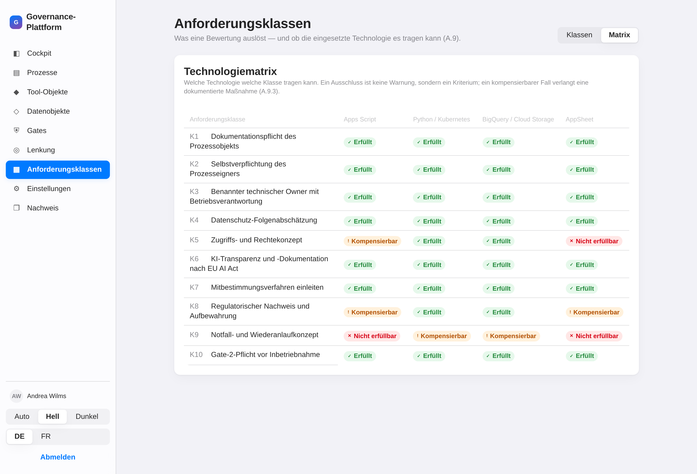
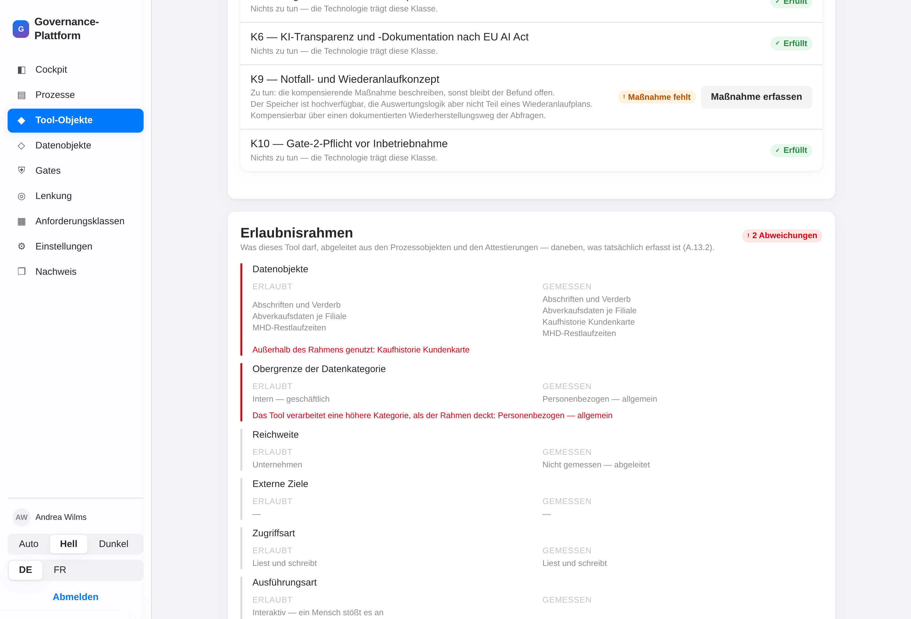
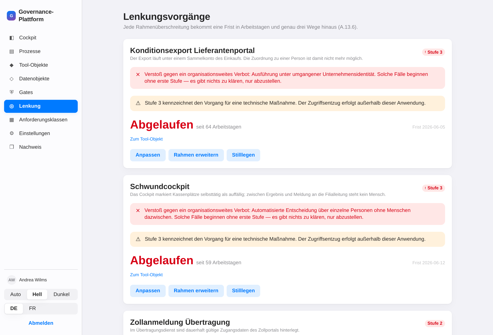
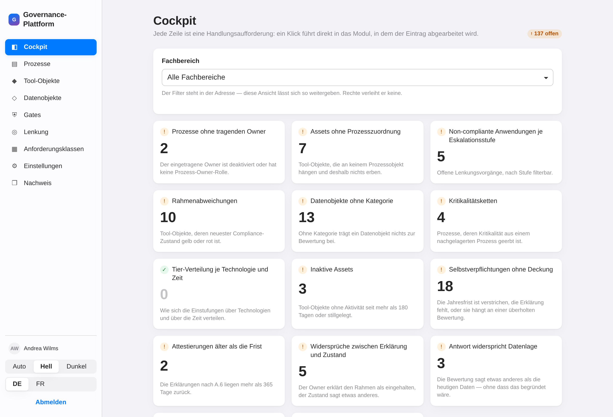
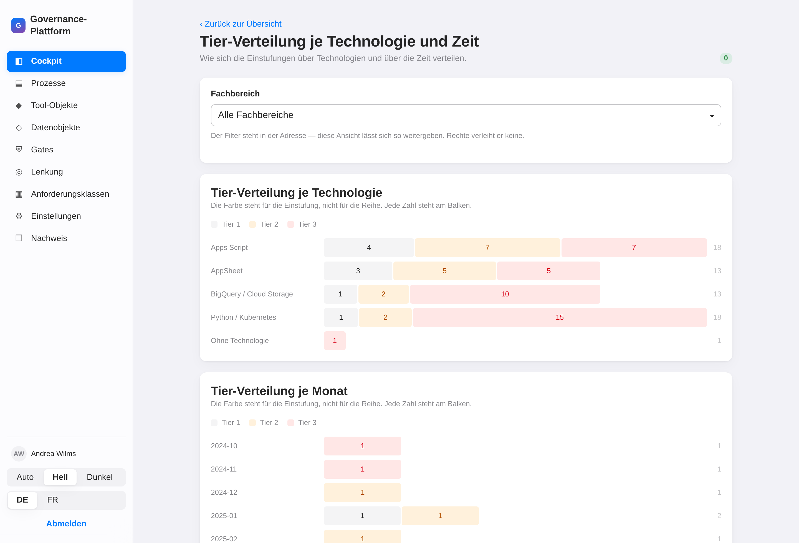
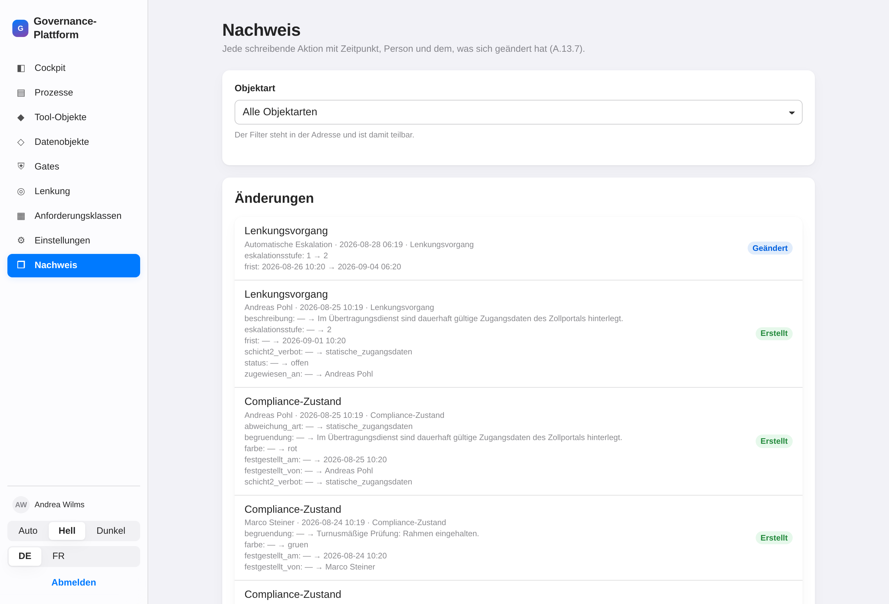
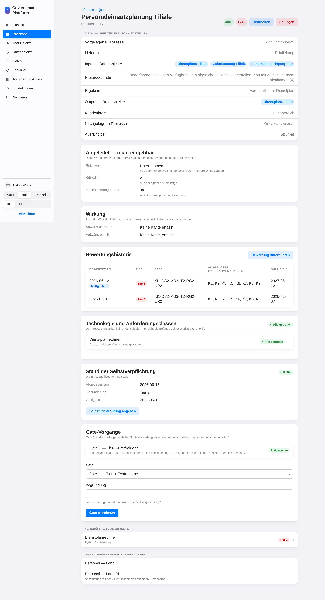

<!--
Diese Datei ist zweierlei: ein lesbares Dokument im Repository und ein
projizierbarer Foliensatz.

    npx @marp-team/marp-cli@latest docs/praesentation.md -o praesentation.pdf
    npx @marp-team/marp-cli@latest docs/praesentation.md --preview

Dieser Vortrag erklärt ein Vorgehen. Er bittet um keine Erlaubnis: er
beschreibt den Weg, den wir für Citizen Development und Custom Code vorsehen,
und zeigt, wie er greift.

Alle Zahlen stammen aus dem Beispielbestand (`python -m app.bestand`) und sind
in der laufenden Anwendung nachzählbar. Kein Wert ist geschätzt, wo nicht
ausdrücklich „Schätzung" steht.
-->

<style>
  section { font-size: 24px; padding: 46px 62px; }
  section.eng { font-size: 20px; }
  h1 { font-size: 1.9em; }
  h2 { font-size: 1.45em; }
  table { font-size: 0.94em; border-collapse: collapse; }
  th, td { padding: 0.22em 0.6em; }
  blockquote { font-size: 1em; }
  ul, ol { line-height: 1.45; }
</style>

# Governance by Design für Citizen Development

**Wie aus gewachsenen Werkzeugen ein geführter Bestand wird**

Vorstellung für Fachbereiche · Betriebsrat · Zentrale IT · Prozess-Owner

---

## Worum es hier geht

In den Fachbereichen werden Werkzeuge gebaut. Das ist keine Frage, die noch
offen wäre — es geschieht bereits, in Tabellen mit Makros, in kleinen Skripten,
in Apps, die jemand an einem Nachmittag zusammengesteckt hat. Und es ist
richtig so: die Fachlichkeit sitzt im Fachbereich.

Dieser Vortrag erklärt, **wie wir künftig damit umgehen** — welche Begriffe
gelten, wer was tut, und woran alle merken, dass etwas aus dem Rahmen läuft.

Er bittet um keine Erlaubnis. Er beschreibt den Weg.

---

## Die Ausgangslage, in Zahlen

Der Bestand, den wir gleich zeigen, bildet einen kompletten
Unternehmensbereich ab — zehn Fachbereiche einer Handelsgruppe mit ihren
Landesgesellschaften.

| | |
|---|---|
| Fachbereiche und Organisationseinheiten | 10 · 41 |
| Prozessobjekte | 56 |
| Werkzeuge (Tool-Objekte) | 73 |
| Datenobjekte | 93 |
| Beteiligte Menschen | 70 |

Das ist keine Hochrechnung. Das ist die Größenordnung **eines** Bereichs.

---

## Was passiert, wenn man nichts tut

* Niemand kann sagen, welche Werkzeuge personenbezogene Daten verarbeiten.
* Niemand weiß, was ausfällt, wenn eine Person das Haus verlässt.
* Der Betriebsrat erfährt von einer Leistungsauswertung, **wenn sie läuft.**
* Die Revision fragt nach einem Nachweis, den es nicht gibt.
* Und im Ernstfall — Rückruf, Prüfung, Vorfall — fehlt genau die Angabe,
  die man dann in Stunden braucht.

---

## Was passiert, wenn man verbietet

Verbote verlagern. Sie verhindern nicht.

Das Werkzeug entsteht trotzdem — nur ohne Meldung, ohne Owner, ohne
Stellvertretung, ohne Protokoll. Dieselbe Wirkung, keine Sichtbarkeit.

> Wer Citizen Development verbietet, bekommt Citizen Development ohne
> Governance.

---

## Die Leitidee in einem Satz

> **Wer ein Werkzeug baut, bekommt einen Rahmen, in dem er sich frei bewegt —
> und die Organisation sieht es, wenn er ihn verlässt.**

Kein Genehmigungsstau. Keine Formularschleife. Ein Rahmen, der sich aus dem
ergibt, was der Prozess ohnehin tut.

---

## Drei Objekte, mehr nicht

| Objekt | Antwort auf | Beispiel |
|---|---|---|
| **Prozessobjekt** | Was geschieht fachlich? | Personaleinsatzplanung Filiale |
| **Tool-Objekt** | Womit geschieht es? | Dienstplanrechner |
| **Datenobjekt** | Woran geschieht es? | Dienstpläne, Zeiterfassung |

Warum genau drei: jede weitere Kategorie wäre Doppelpflege. Ein Datenobjekt
wird **einmal** eingeordnet und von allen Prozessen und Werkzeugen
referenziert, die es anfassen.

---

## Der wichtigste Grundsatz

> **Was aus vorhandenen Daten berechenbar ist, wird nie erfragt.**

Reichweite, Kritikalität und die Mitbestimmungsrelevanz werden **abgeleitet**,
nicht abgefragt. Sie stehen nicht zur Wahl.

Das ist der Unterschied zwischen einem Formular und einem Werkzeug: das
Formular fragt, was es wissen könnte. Das Werkzeug rechnet es aus und sagt,
woher es kommt.

---

## Beispiel einer Ableitung

Prozessobjekt „Frischedisposition", eigene Ausfallfolge: *spürbar*.

* Es beliefert den Bestellvorschlag der Filialen — der ist *kritisch*.
* Also ist die Frischedisposition **mindestens so kritisch**: Stufe 3.

Niemand hat das eingetragen. Es ergibt sich aus der Prozesskette, und die
Anwendung schreibt dazu, woher die Stufe stammt.

Im Bestand betrifft das **4 Prozessobjekte** — sie wirken für sich harmlos und
sind es wegen ihrer Nachfolger nicht.

---

## Die Bewertung: sechs Fragen an die Wirklichkeit

| Dimension | Frage dahinter |
|---|---|
| **KI** | Ist ein KI-System beteiligt? Fällt es unter den EU AI Act? |
| **Datenschutz** | Werden personenbezogene Daten verarbeitet? |
| **Mitbestimmung** | Ist Verhaltens- oder Leistungskontrolle möglich? |
| **IT-Sicherheit** | Schreibender Zugriff auf Kernsysteme? Weg nach außen? |
| **Regulatorik** | Rechnungslegung, Steuer, Aufsicht, Aufbewahrung? |
| **Unternehmerisches Risiko** | Was passiert bei Ausfall? |

Achtzehn Fragen, je Block die schärfste zuerst. Ergebnis ist ein Profil:
`KI1-DS2-MB3-IT2-RG2-UR2`.

---

## Vom Profil zum Tier

Das **Tier** ist die höchste erreichte Stufe — nicht die Summe, nicht der
Durchschnitt. Eine einzige Dimension auf Stufe 3 genügt.

| Tier | Was verlangt wird |
|---|---|
| **1** | Dokumentieren. Owner und Stellvertretung benennen. |
| **2** | Zusätzlich: technischer Owner, Zugriffs- und Rechtekonzept, Protokollierung |
| **3** | Zusätzlich: **Freigabe vor Inbetriebnahme**, jährliche Erneuerung, Wiederanlaufkonzept |

Im Bestand: **8 · 15 · 30**. Die Mehrheit der Kernprozesse eines Handels­unter­nehmens ist Tier 3 — weil sie rechnungslegungsrelevant sind oder weil ihr Ausfall den Betrieb trifft. Das ist kein Fehler der Skala, sondern ihr Ergebnis.

---

<!-- _class: eng -->

## Kritikalität und Tier sind **nicht** dasselbe

Beide laufen von 1 bis 3, und genau deshalb werden sie verwechselt.

| | **Kritikalität** | **Tier** |
|---|---|---|
| Frage | Was passiert, wenn er ausfällt? | Wie streng wird er behandelt? |
| Herkunft | eine Größe, gerechnet | Gesamturteil über **sechs** Dimensionen |
| Gilt für | nur Prozessobjekte | nur Bewertungen |

Es gibt **genau eine** Verbindung: die Kritikalität ist der **Vorschlag für die
Dimension UR** — unternehmerisches Risiko. Sie ist die einzige der sechs, die
sich vollständig ableiten lässt, weil die Ausfallfolge ein Pflichtfeld ist und
die Vererbung entlang der Kette gerechnet wird.

*Ausfallfolge + Kette → Kritikalität → Vorschlag UR → höchste von sechs → Tier*

Ein Vorschlag, kein Zwang: wer abweicht, begründet. Und umgekehrt kann ein
hohes Tier ganz ohne Kritikalität entstehen — aus Datenschutz, aus KI, aus
Nachweispflicht.

---

## Vorschlag statt Verhör

Die Anwendung **schlägt Antworten vor** und nennt den Beleg:

> „Datenobjekt ‚Zeiterfassung Filiale' trägt die Kategorie personenbezogen."

Wer abweicht, begründet — einmal, in einem Satz, dauerhaft nachlesbar. Ohne
Begründung wird die Bewertung nicht angenommen.

**Ein echter Fall aus dem Bestand.** Der Prozess „Arbeitssicherheits­meldungen"
verarbeitet Unfallmeldungen. Die Datenlage schlägt Mitbestimmungs-Stufe 3 vor.
Der Prozesseigner widerspricht und schreibt dazu:

> „Unfallmeldungen sind Gesundheitsdaten, aber keine Leistungs- oder
> Verhaltensdaten. Die Auswertung erfolgt ausschließlich je Filiale und
> Gefährdungsart; eine Zurechnung zu einzelnen Beschäftigten findet nicht statt
> und ist mit dem Betriebsrat so vereinbart."

Diese Begründung steht dauerhaft am Vorgang. Sie ist überprüfbar.

---

<!-- _class: eng -->

## Was eine Bewertung auslöst: die Anforderungsklassen

| | Klasse | Ausgelöst durch | im Bestand |
|---|---|---|---|
| K1 | Dokumentationspflicht | immer | 52 |
| K2 | Selbstverpflichtung des Eigners | immer | 52 |
| K3 | Benannter technischer Owner | irgendeine Dimension ≥ 2 | 44 |
| K4 | Datenschutz-Folgenabschätzung | Datenschutz = 3 | 7 |
| K5 | Zugriffs- und Rechtekonzept | Datenschutz ≥ 2 oder IT ≥ 2 | 40 |
| K6 | KI-Transparenz nach EU AI Act | KI ≥ 1 | 7 |
| K7 | **Mitbestimmungsverfahren einleiten** | Mitbestimmung ≥ 1 | 13 |
| K8 | Regulatorischer Nachweis | Regulatorik ≥ 2 | 34 |
| K9 | Notfall- und Wiederanlaufkonzept | Risiko ≥ 2 | 35 |
| K10 | Gate-2-Pflicht vor Inbetriebnahme | KI, IT oder Risiko = 3 | 18 |

Jede Klasse hängt an **einer** nachvollziehbaren Bedingung. Keine Ermessensfrage.

---

## Kann die gewählte Technik das überhaupt tragen?



---

## Die Matrix ist eine Entscheidung, keine Warnung

Sieben der zehn Klassen sind **organisatorisch** — keine Plattform hindert
jemanden daran, den Betriebsrat zu beteiligen. Sie stehen überall auf *erfüllt*,
und das ist die Aussage: hier entscheidet die Organisation, nicht das Werkzeug.

Drei Klassen sind **technisch**: Rechtekonzept, revisionssichere Aufbewahrung,
Wiederanlauf.

* **Nicht erfüllbar** bei einer ausgelösten Klasse ⇒ **Ausschluss.** Der Prozess
  läuft mit dieser Technologie nicht.
* **Kompensierbar** ⇒ eine dokumentierte Maßnahme ist Pflicht. „Kompensierbar"
  ist eine Aufgabe, kein Zustand.

Im Bestand: **26 Ausschlüsse**, **26 fehlende Maßnahmen**, 30 dokumentierte,
7 ungeprüft (Technologie nicht angegeben).

---

<!-- _class: eng -->

## Was ein Werkzeug erbt — und was es selbst mitbringt

Ein Tool-Objekt hat **weder Tier noch Kritikalität als eigene Angabe**. Es
erbt das **Maximum** über alle Prozesse, an denen es hängt: Kritikalität,
Reichweite, Tier, Mitbestimmungsflag und die Anforderungsklassen.

Warum das Maximum: ein Werkzeug an zwei Prozessen wäre sonst über die
schwächere Kante zu umgehen. Und damit eine Zahl nicht ohne Adresse dasteht,
wird die **maßgebliche Kante benannt** — im Bestand etwa die
„Filialkennzahlen-Tafel", die an zwei Prozessen hängt und ihr Tier 3 aus dem
Bestellvorschlag bezieht.

| Werkzeuge im Bestand | |
|---|---|
| erben Tier 1 · 2 · 3 | 8 · 16 · 39 |
| ohne Prozesskante — erben **nichts** | 7 |

Die sieben ohne Kante sind nicht regelwidrig, sondern **unbewertet**: kein
Prozess, also kein Rahmen, also nichts, wogegen zu prüfen wäre. Für den
Altbestand ist das der Ausgangszustand und die Arbeitsliste.

> Bewertet wird der Prozess, nie das Werkzeug.

---

## Der Erlaubnisrahmen: was ein Werkzeug darf



---

## Sieben Elemente, jedes mit zwei Seiten

Der Rahmen wird **abgeleitet**, nicht eingegeben — aus den Prozessen, an denen
das Werkzeug hängt. Es gilt das Positivlistenprinzip: was nicht ausdrücklich
erlaubt ist, ist nicht erlaubt.

Neben jedem **erlaubten** Element steht das **gemessene**. Erst beide
nebeneinander machen aus einer Behauptung eine prüfbare Aussage:

*Datenobjekte · Obergrenze der Datenkategorie · Reichweite · externe Ziele ·
Zugriffsart · Ausführungsart · Ausführungsidentität*

Im Bestand weichen **11 Werkzeuge** in mindestens einem Element ab — jedes
davon ein Fall, den vorher niemand gesehen hätte.

---

## Der Abgleich: wer liefert welche Seite

| | liefert |
|---|---|
| **Prozessobjekt** | was **erlaubt** ist — aus SIPOC, Bewertung, Deklaration |
| **Tool-Objekt** | was **gemessen** wird — aus Telemetrie und Attestierungen |

Eine Abweichung ist damit keine Eigenschaft eines der beiden, sondern das
Ergebnis eines Vergleichs. Deshalb kann ein Werkzeug eine Abweichung auslösen,
ohne selbst eine Einstufung zu haben: es liefert die eine Hälfte.

Und es muss dafür nichts Verbotenes tun. Es gilt das **Positivlistenprinzip** —
was nicht ausdrücklich erlaubt ist, ist nicht erlaubt. Es genügt, dass ein
Werkzeug etwas tut, das im Rahmen nicht steht.

**Der Abgleich läuft von selbst.** Ausgelöst durch Telemetrieänderung, nicht
durch Kalender oder Stichprobe. Solange grün, sieht niemand etwas und es
entsteht kein Vorgang: **der grüne Zustand ist kostenlos.** Genau das macht das
Modell skalierbar — Aufwand entsteht nur dort, wo etwas abweicht.

---

## Schicht 2: sechs Verbote, durch nichts freischaltbar

| Verbot | Erkennt die Anwendung? |
|---|---|
| Umgangene Unternehmensidentität (geteiltes Konto) | **ja** |
| Dauerhaft hinterlegte Zugangsdaten | **ja** |
| Undeklarierte Datenquellen | **ja** |
| Entscheidung über Personen ohne Menschen dazwischen | **ja** |
| Daten ins offene Netz | zu melden |
| Umgangene Protokollierung | zu melden |

Keine Bewertung, kein Tier und keine Freigabe schaltet diese sechs frei.
Deshalb entfällt bei ihnen die erste Eskalationsstufe: es gibt nichts zu
klären, nur abzustellen.

---

## Wenn etwas abweicht: der Lenkungsvorgang



---

## Fristen, die zum Risiko passen

| | Tier 1 | Tier 2 | Tier 3 |
|---|---|---|---|
| Frist bis Stufe 2 | 30 | 15 | **5** Arbeitstage |
| Nachfrist bis Stufe 3 | 15 | 10 | **5** Arbeitstage |

* **Stufe 1** — der Verantwortliche wird informiert.
* **Stufe 2** — die Führungskraft ist informiert.
* **Stufe 3** — gekennzeichnet für eine technische Maßnahme.

Genau **drei Auswege**, keine vierte Möglichkeit: *anpassen* · *Rahmen
erweitern* (verlangt eine neue Bewertung) · *stilllegen*.

Im Bestand offen: **1 · 2 · 2** über die drei Stufen.

---

<!-- _class: eng -->

## Der ganze Weg, an einem Objekt

| Schritt | Was geschieht | Wer |
|---|---|---|
| 1 | Prozessobjekt anlegen: zehn Felder, Kanten setzen | Prozess-Owner |
| 2 | **Kritikalität** ergibt sich aus Ausfallfolge und Kette | gerechnet |
| 3 | Bewertung: achtzehn Fragen, sechs Dimensionen, Vorschläge mit Beleg | Prozess-Owner |
| 4 | **Tier** = höchste Stufe · **K-Klassen** aus dem Profil | gerechnet |
| 5 | Ab Tier 3: Selbstverpflichtung und **Gate 1** vor Inbetriebnahme | Owner · Governance |
| 6 | Werkzeug an den Prozess hängen: es **erbt** das Maximum | technischer Owner |
| 7 | **Erlaubnisrahmen** entsteht — sieben Elemente, abgeleitet | gerechnet |
| 8 | **Abgleich** erlaubt gegen gemessen, fortlaufend | niemand |
| 9 | Bei Abweichung: **Lenkungsvorgang** mit Frist nach Tier | technischer Owner |
| 10 | Drei Auswege: anpassen · Rahmen erweitern · stilllegen | technischer Owner |

Vier der zehn Schritte rechnet die Anwendung. An **zwei** Stellen wartet
jemand — Gate 1 und Gate 2. Alles andere läuft ungebremst.

**Und steigt ein laufender Prozess auf Tier 3**, entfällt seine Freigabe: er
läuft weiter, ist aber nicht mehr freigegeben, und der Gate-1-Vorgang liegt
sofort vor. „Läuft" und „darf laufen" sind zwei Aussagen.

---

## Beispiel A — der geführte Weg

**Personaleinsatzplanung Filiale**, Fachbereich Personal, in zwei Ländern umgesetzt

1. Prozessobjekt angelegt: zehn Felder, drei Datenobjekte referenziert.
2. Bewertung: `KI1-DS2-MB3-IT2-RG2-UR2` → **Tier 3**.
   Abgeleitet: Reichweite *unternehmen*, Kritikalität 2, **Mitbestimmung: ja**.
3. Ausgelöst: K1, K2, K3, K5, K6, **K7**, K8, K9.
4. Selbstverpflichtung des Eigners abgegeben — sechs prüfbare Aussagen.
5. **Gate 1** eingereicht und freigegeben. Erst danach: aktiv.
6. Der Dienstplanrechner erbt Tier 3 und läuft im Rahmen.

Die Reihenfolge ist nicht empfohlen, sie ist erzwungen. Ohne vollständige
Erklärung und ohne Gate-1-Freigabe wechselt der Prozess nicht auf *aktiv*.

---

## Beispiel B — die Abweichung

**Konditionsexport Lieferantenportal**, Apps Script, Fachbereich Einkauf Food

* Läuft unter einem **Sammelkonto** des Einkaufs.
* Die Anwendung erkennt das selbst: Verstoß gegen Schicht 2,
  „umgangene Unternehmensidentität".
* Deshalb **Start in Stufe 2**, nicht in Stufe 1 — die erste Stufe entfällt.
* Frist verstrichen → automatischer Lauf → **Stufe 3**.
* Das Werkzeug erbt Tier 3 aus der Konditionsverhandlung. Sein Owner hat
  gleichzeitig erklärt, es laufe im Rahmen.

Diesen **Widerspruch zwischen Erklärung und Zustand** führt das Cockpit als
eigene Zeile — im Bestand fünfmal.

---

## Das Cockpit: vierzehn Handlungsaufforderungen



---

## Keine Kennzahlen — Aufgaben

Jede Zeile nennt eine Zahl, einen Zustand und **den Satz, was zu tun ist**. Ein
Klick führt vorgefiltert dorthin, wo der Eintrag abgearbeitet wird.

Eine Zeile ohne Handlungssatz wäre eine Kennzahl, und Kennzahlen steuern nichts.

Der Bereichsfilter steht in der Adresse: eine gefilterte Ansicht lässt sich
weitergeben. Rechte verleiht sie nicht — was jemand sieht, entscheidet
ausschließlich der Server.

---

## Wie sich der Bestand über die Zeit entwickelt



---

## Der Nachweis: wer, wann, was



---

## Lückenlos und ausschließlich anhängend

Jede schreibende Aktion steht im Protokoll: mit Zeitpunkt, mit **Namen**, und
mit dem, was sich geändert hat — Feld für Feld, vorher und nachher.

Es gibt in der Anwendung **keinen Weg**, einen Eintrag zu ändern oder zu
löschen. Auch nicht für den Administrator.

Im Bestand: **1 124 Einträge** über gut zwei Jahre.

Das ist die Antwort auf die Frage, die in jeder Prüfung kommt: *Wer hat das
entschieden, und wann?*

---

# Wer darf was

---

## Eine Berechtigung ist immer **Rolle mal Bereich**

Keine der beiden Hälften genügt allein. Die Rolle sagt, *was* jemand tun darf;
der Bereich sagt, *woran*.

Drei Bereichsstufen, mehr gibt es nicht:

| Bereich | Reichweite | Wer ihn trägt |
|---|---|---|
| **global** | das ganze Unternehmen | Governance, Plattform, Auditor, App-Administrator |
| **Fachbereich** | ein Fachbereich mit allen Einheiten darunter | Prozess-Owner, technischer Owner, Datenobjekt-Owner |
| **Einheit** | genau eine Einheit — INT oder ein Land | Prozess-Owner, Prozess-Umsetzer, technischer Owner |

**Ein Bereich gehört einer Rolle, nicht einer Person.** Wer als Prozess-Umsetzer
in Vertrieb DE eingetragen ist, hat dort *nicht* die Sicht eines technischen
Owners. Zwei Zuweisungen an dieselbe Person ergeben zwei getrennte
Berechtigungen — sie addieren sich nicht zu einer breiten.

---

<!-- _class: eng -->

## Die acht Rollen: Aufgabe, Bereich, Aufwand

| Rolle | Wofür sie da ist | Bereich | Aufwand |
|---|---|---|---|
| **Prozess-Owner** | Prozessobjekt anlegen und aktuell halten, bewerten, Selbstverpflichtung abgeben, Gates einreichen | Fachbereich oder Einheit | ~1 h Ersterfassung, danach jährlich bestätigen |
| **Prozess-Umsetzer** | Pflegt die lokale Abweichung einer Umsetzung — und nur diese | eine Landes-Einheit | Minuten je Umsetzung |
| **Technischer Owner** | Tool-Objekt, die drei Attestierungen, Anforderungsklassen umsetzen, Compliance melden | Fachbereich oder Einheit | Minuten je Werkzeug |
| **Datenobjekt-Owner** | Klassifiziert die Quellen seines Fachbereichs — die Kategorie setzt er allein | nur Fachbereich | einmalig je Quelle |
| **Governance** | Gates entscheiden, Technologiematrix, Einstellungen, Lenkungsvorgänge | global | skaliert mit Tier 3, nicht mit dem Bestand |
| **Plattform** | Betreibt die Adapter: Import, Telemetrie, Bestätigung vorgefundener Objekte | global | Betrieb |
| **Auditor** | Liest bereichsübergreifend mit, einschließlich Nachweis. Ändert **nichts** | global | Prüfungsanlass |
| **App-Administrator** | Verwaltet Nutzer und Rollen — und sonst nichts | global | selten |

---

<!-- _class: eng -->

## Was jede Rolle mit welchem Objekt darf

**S** eigener Bereich · **R** über eine Referenz · **G** überall · **–** nicht

| Rolle | Prozessobjekt | Tool-Objekt | Datenobjekt | Übriges |
|---|---|---|---|---|
| **Prozess-Owner** | S, schreibt | R lesen, Kante setzen | R lesen, als Output anlegen | – |
| **Prozess-Umsetzer** | S lesen, nur die lokale Abweichung | R lesen | R lesen | – |
| **Technischer Owner** | R lesen | S, schreibt und attestiert | R lesen | – |
| **Datenobjekt-Owner** | – | – | S, setzt die Kategorie | – |
| **Governance** | G, schreibt | G, schreibt | G, schreibt | Gates, Matrix, Einstellungen |
| **Plattform** | G lesen | G lesen, bestätigt Importe | G lesen, bestätigt Importe | Import |
| **Auditor** | G lesen | G lesen | G lesen | Nachweis |
| **App-Administrator** | – | – | – | Nutzer, Rollen, Nachweis |

Der App-Administrator vergibt jeden Zugriff — **genau deshalb** hat er selbst
keinen fachlichen. Und die Attestierung eines Werkzeugs kann niemand außer
seinem technischen Owner abgeben: eine Erklärung, die ein anderer abgeben
kann, ist keine.

---

<!-- _class: eng -->

## Nicht ausgeblendet — nicht vorhanden

Was jemand nicht sehen darf, liefert der Server **nicht**. Nicht ausgegraut,
nicht gefiltert in der Anzeige: die Antwort enthält es nicht. Das gilt für
Listen, für den Direktaufruf über die Kennung, für Auswertungen und für die
Auswahllisten in Formularen.

Umgekehrt rechnet der Server zu jedem Objekt aus, was der Anfragende damit tun
darf, und schreibt es an die Antwort. Die Oberfläche baut die Regeln nicht
nach — sie liest sie und blendet aus, was nicht geht, mit einem Satz dazu, wer
es dürfte.

Sechs der zehn Zugänge des gezeigten Bestands, unverändert abgefragt:

Fünf davon tragen **dieselbe Rolle nicht**, sitzen aber im **selben
Fachbereich** — der Logistik. Nur so sieht man, woher ein Unterschied kommt:

| Zugang | Prozesse | Werkzeuge | Datenobjekte | Katalog | Nachweis |
|---|---|---|---|---|---|
| Governance | 56 | 73 | 93 | 87 | ja |
| Prozess-Owner, ganze Logistik | 6 | 9 | 11 | 87 | nein |
| Prozess-Owner, nur Logistik DE | 4 | 7 | 8 | 87 | nein |
| Datenobjekt-Owner, ganze Logistik | **0** | **0** | 11 | 87 | nein |
| App-Administrator | 0 | 0 | 0 | 87 | ja |
| ohne Rolle | 0 | 0 | 0 | – | nein |

Zeile 2 gegen 3: **dieselbe Rolle, engerer Bereich.** Zeile 2 gegen 4:
**derselbe Bereich, andere Rolle** — der Datenobjekt-Owner sitzt in derselben
Logistik und sieht kein einziges Prozessobjekt.

Der **Katalog** ist die eine, bewusste Ausnahme: Name, Fachbereich, Kategorie
und Quellsystem jeder Quelle, damit ein Prozess der Logistik die
Personalstammdaten überhaupt als Eingang benennen kann. Vier Felder, mehr
nicht — und ohne Rolle auch die nicht.

---

# Für den Betriebsrat

---

## Mitbestimmung ist keine Kategorie, sondern ein Ergebnis

Sie kann bei **jeder** Datenart auftreten, weil sie am Verwendungszweck hängt,
nicht an der Datenart. Deshalb wird sie berechnet, nicht angekreuzt.

**Die Regel ist eine Konjunktion:**

> Personenbezug **und** (Wirkung auf einzelne Beschäftigte **oder**
> Leistungs- und Verhaltensdaten)

Personenbezug allein macht einen Prozess nicht mitbestimmungspflichtig. Eine
Wirkung auf Beschäftigte ohne Personenbezug gibt es nicht.

Im Bestand tragen **10 von 56** Prozessobjekten das Flag; **13** lösen K7 aus.

---

## Drei Zusagen an die Beteiligung

**1. Vor der Inbetriebnahme, nicht danach.**
K7 lautet: „Der Betriebsrat ist vor der Inbetriebnahme zu beteiligen; ohne
abgeschlossenes Verfahren darf der Prozess nicht produktiv gehen."

**2. Automatisierte Entscheidungen über Personen sind verboten.**
Nicht bewertungspflichtig — **verboten**. Schicht 2, durch keine Freigabe
aufhebbar: kein Ergebnis über einzelne Personen ohne Menschen dazwischen.

**3. Abweichungen sind begründungspflichtig und bleiben stehen.**
Wer der Datenlage widerspricht, schreibt einen Satz dazu. Der Satz ist Teil des
Nachweises und verschwindet nicht.

---

## Ein Fall, an dem sich das zeigt

**Bewerbervorauswahl** — Profil `KI3-DS3-MB3-IT2-RG2-UR1`, Tier 3

* KI-Stufe 3: Hochrisiko-Anwendungsfall nach **Anhang III EU AI Act**
  (Personalauswahl).
* Ausgelöst: K4 (Folgenabschätzung), K6 (KI-Transparenz), **K7**, K10.
* Gate 1 steht auf **„in Prüfung"** mit dem Vermerk:

  > „Die Datenschutz-Folgenabschätzung liegt vor, die Stellungnahme des
  > Betriebsrats steht noch aus."

* Status des Prozessobjekts: **Entwurf.** Nicht aktiv. Nicht im Einsatz.

Der Torwächter ist keine Absichtserklärung. Er ist eine Bedingung im Code.

---

## Wie der Betriebsrat eingebunden ist

**Fachlich** über K7: die Beteiligung wird ausgelöst, bevor ein Prozess
produktiv geht, und der Stand des Verfahrens hängt am Gate.

**Technisch** über einen lesenden Zugang. Die Anwendung kennt acht Rollen;
eine eigene Betriebsratsrolle ist **bewusst nicht** vorweggenommen worden. Die
Auditor-Rolle liest bereichsübergreifend und schreibt nie — sie ist der
naheliegende Zugang.

Drei Punkte, die wir gemeinsam festlegen und nicht einseitig entscheiden:

* Umfang des Zugangs — alle Bereiche, oder die mitbestimmungsrelevanten?
* Aktive Benachrichtigung bei K7, oder Abruf im Cockpit?
* Eigene Rolle mit eigenem Namen, oder Auditor?

---

# Für die zentrale IT

---

## Schatten-IT wird sichtbar, nicht bekämpft

Der Sync findet, was da ist. Eine vorgefundene Anwendung geht durch den
**Meldepfad**: bestätigen → einem Prozessobjekt zuordnen → Prozess bewerten.
Wer die Frist verstreichen lässt, wechselt in den **Blockierungspfad** —
dieselbe Aufgabe, aber die Frist ist abgelaufen.

Im Bestand: **7 vorgefundene Werkzeuge**, davon 6 noch auf dem Weg.

Eine Alt-Anwendung, die bestätigt, zugeordnet und bewertet ist, verschwindet
aus der Liste. Sie ist dann keine Alt-Anwendung mehr, sondern ein geführtes
Tool-Objekt.

---

<!-- _class: eng -->

## Was die IT konkret bekommt

| Frage | Antwort in der Anwendung |
|---|---|
| Welche Werkzeuge laufen unter geteilten Konten? | Schicht 2, automatisch erkannt |
| Wo liegen Dauer-Zugangsdaten? | Schicht 2, automatisch erkannt |
| Wer schreibt auf produktive Kernsysteme? | IT-Dimension 3, Zugriffsart am Rahmen |
| Was geht nach außen, wohin? | Element „externe Ziele", erlaubt gegen gemessen |
| Was fällt aus, wenn X ausfällt? | Kritikalität entlang der Prozesskette |
| Welche Technik trägt Wiederanlauf nicht? | Technologiematrix, K9 |

Im Bestand automatisch erkannt: 2 geteilte Konten, 1 Satz Dauer-Zugangsdaten,
1 undeklarierte Quelle, 1 Entscheidung ohne Menschen dazwischen.

---

## Wie es sich in die Landschaft fügt

* **Kein zweites Identitätssystem.** Anmeldung über die zentrale
  Unternehmens­identität; die Anwendung führt keine Passwörter.
* **Rollen und Bereiche sind orthogonal.** Eine Berechtigung entsteht nie aus
  einer Rolle allein, sondern aus Rolle **und** Geltungsbereich.
* **Die Plattform provisioniert nichts.** Sie beantwortet Fragen. Vier
  ausschließlich lesende Endpunkte stehen für die andockende
  Infrastruktur-Provisionierung bereit — Tier, Klassen, Erlaubnisrahmen,
  Änderungs-Delta.
* **Stammdaten kommen von außen.** Fachbereiche, Einheiten und Teams werden
  importiert und nie hier gepflegt; ein Sync fasst governance-gepflegte Felder
  nie an.
* **Betrieb:** drei Container, PostgreSQL, Migrationen vorwärts und rückwärts
  geprüft, zwei geplante Läufe (Erinnerungen, Eskalationen).

---

# Für Fachbereich und Prozess-Owner

---

<!-- _class: eng -->

## Was Sie tun — und was nicht

**Was Sie tun**

* Zehn Felder ausfüllen: Lieferant, Eingang, Schritte, Ergebnis, Kunde,
  Ausfallfolge, Owner, Stellvertretung.
* Achtzehn Fragen beantworten — die meisten davon sind bereits vorgeschlagen,
  mit Beleg.
* Eine Selbstverpflichtung abgeben: sechs Aussagen, ankreuzen und kommentieren.

**Was Sie nicht tun**

* Kein Ticket schreiben. Kein Formular per Mail. Keine Rückfrage-Schleife.
* Nichts doppelt pflegen: Reichweite, Kritikalität und Mitbestimmung rechnet
  die Anwendung.
* Nichts wiederholen, solange sich nichts ändert.

*Schätzung für die Ersterfassung eines Prozessobjekts: 20 bis 30 Minuten.
Jährlich danach ab Tier 3: ein Klick, solange das Profil gleich bleibt.*

---

## Was Sie dafür bekommen

* **Eine Antwort auf die Frage, ob Sie dürfen** — vor der Arbeit, nicht danach.
* **Einen Ansprechpartner**, der benannt ist und eine Stellvertretung hat.
* **Keine Überraschung durch die Revision.** Was Sie erklärt haben, steht da.
* **Freiraum innerhalb des Rahmens.** Solange Sie sich darin bewegen, fragt
  niemand nach.
* **Eine Warnung, bevor es teuer wird**: dass AppSheet Ihr Wiederanlaufkonzept
  nicht tragen kann, erfahren Sie vor dem Bau, nicht beim ersten Ausfall.

---

## Der ganze Vorgang an einem Prozessobjekt



---

# Grenzen, Stand, Entscheidung

---

## Was dieses Werkzeug ausdrücklich **nicht** tut

* Es **provisioniert keine Infrastruktur** — keine Projekte, keine Namespaces,
  keine Deployments. Das bleibt bei den anschließenden Systemen.
* Es **scannt keine Endgeräte** und liest keine Inhalte. Es kennt nur, was
  gemeldet oder über definierte Schnittstellen importiert wird.
* Es **überwacht keine Personen.** Es führt keine Leistungsdaten und wertet
  keine Beschäftigten aus.
* Es **ersetzt weder Datenschutz-Folgenabschätzung noch
  Mitbestimmungsverfahren.** Es löst sie aus und hält fest, dass sie laufen.
* Es **entscheidet nichts allein.** Jede Freigabe, jede Ablehnung, jede
  Auflösung trägt einen Namen.

---

## Stand der Umsetzung

Sieben Phasen, jede einzeln abgenommen. Die Abnahme läuft **über die
Oberfläche**, nicht gegen die Schnittstelle:

| Prüfung | Umfang |
|---|---|
| Fachlogik (Backend) | 4 575 Tests, 98 % Abdeckung |
| Oberfläche (Bausteine) | 249 Tests |
| Oberflächenläufe je Phase | 32 |
| **Anwendervorgänge** | **133** |

Der Vorgangskatalog listet jeden Handgriff, den ein Mensch später tut, mit
seinem erwarteten Ergebnis — und fährt ihn im Browser nach. Er beantwortet
nicht „funktioniert es", sondern „ist es vollständig".

Zwei Sprachen (deutsch, französisch), helle und dunkle Darstellung.

---

## Offene Punkte — vollständig

1. **Kein eigener Zugang für den Betriebsrat.** Heute nur über die
   Auditor-Rolle. Zu entscheiden (Folie oben).
2. **Die IT-Dimension wird nicht vorgeschlagen.** Dafür fehlt Telemetrie aus
   den Zielplattformen; sie bleibt vollständig zu erklären.
3. **Zwei der sechs Verbote sind nur meldbar**, nicht erkennbar: umgangene
   Protokollierung und Daten ins offene Netz.
4. **Benachrichtigungen werden erzeugt, nicht versendet.** Der Versandweg ist
   anzubinden.
5. **Feiertage bleiben in den Fristen außen vor** — der Kalender ist
   landesabhängig, die Anwendung läuft in mehreren Ländern.
6. **Die Anbindung an die zentrale Identität ist vorgesehen**, hier läuft ein
   Entwicklungsmodus.
7. **Das Architekturdokument liegt dem Repository nicht bei**; Verweise darauf
   sind nicht gegenkontrolliert.

---

## Selbst ansehen

Die Anwendung startet lokal mit drei Befehlen und füllt sich mit genau dem
Bestand, den Sie in dieser Präsentation gesehen haben:

```bash
docker compose up -d --build
docker compose exec backend python -m app.bestand --leeren
# Oberfläche: http://localhost:5173/de/cockpit
```

Der Bestand entsteht ausschließlich über die Fachlogik — mit
Berechtigungsprüfung, Torwächtern und Vorschlagsabgleich. Was Sie sehen, hätte
die Anwendung genauso entstehen lassen.

---

## Wie wir das einführen

Nicht auf einmal, sondern Bereich für Bereich. Den Anfang macht ein Bereich mit
hoher Werkzeugdichte — damit der Meldepfad trägt, bevor die schwierigen Fälle
kommen.

| Schritt | Wer |
|---|---|
| 1. Bestand aufnehmen: Sync anbinden, Meldepfad starten | Zentrale IT |
| 2. Aktive Prozessobjekte erfassen und bewerten | Fachbereich, PO |
| 3. Zugang und Beteiligung des Betriebsrats festlegen | BR, Governance |
| 4. Technologiematrix gegen die eigene Landschaft prüfen | Zentrale IT |
| 5. Erfahrungen einarbeiten, nächsten Bereich anschließen | alle |

Neue Werkzeuge gehen ab sofort diesen Weg. Für den Bestand gilt der Meldepfad
aus A.16 — mit Frist, nicht mit Stichtag.

---

## Woran wir merken, ob das Vorgehen trägt

Drei Zahlen, die wir je Bereich mitführen — als Steuerung, nicht als Nachweis
gegenüber irgendwem:

1. **Vollständigkeit** — Wie viele Werkzeuge sind erfasst, und wie viele
   vermuten wir noch außerhalb?
2. **Aufwand** — Wie lange braucht ein Prozess-Owner tatsächlich, von der
   Anlage bis zur Aktivierung? Wird der Weg zu lang, ändern wir den Weg.
3. **Wirkung** — Wie viele Befunde hat das Cockpit erzeugt, und wie viele
   davon waren vorher unbekannt?

Die dritte Zahl ist die interessanteste. Bleibt sie klein, ist der Bestand
gesünder als vermutet — auch das wäre ein Ergebnis, und wir würden den Aufwand
entsprechend zurücknehmen.

---

## Zusammengefasst

* Citizen Development findet statt. Die Frage ist nur, ob es sichtbar ist.
* Der Rahmen wird **abgeleitet**, nicht verhandelt — aus dem, was der Prozess
  ohnehin tut.
* Was berechenbar ist, wird nicht gefragt. Was erklärt wird, bleibt stehen.
* Sechs Verbote sind durch nichts freischaltbar.
* Jede Entscheidung trägt einen Namen, jede Abweichung eine Frist.
* Und es ist gebaut, geprüft und vorführbar — nicht konzipiert.

**So gehen wir mit Citizen Development und Custom Code um.** Ihre Fragen.

---

## Anhang — Begriffe

| Begriff | Bedeutung |
|---|---|
| **Prozessobjekt** | Der fachliche Vorgang, zehn Felder nach SIPOC |
| **Tool-Objekt** | Das Werkzeug, mit dem der Vorgang läuft |
| **Datenobjekt** | Ein einmal eingeordneter Datenbestand |
| **Profil** | Die sechs Stufen, z. B. `KI1-DS2-MB3-IT2-RG2-UR2` |
| **Tier** | Die höchste Stufe des Profils, 1 bis 3 |
| **K-Klasse** | Eine ausgelöste Anforderung, K1 bis K10 |
| **Erlaubnisrahmen** | Was ein Werkzeug darf — abgeleitet, siebenteilig |
| **Schicht 2** | Sechs organisationsweite Verbote |
| **Gate 1 / Gate 2** | Erstfreigabe ab Tier 3 / Freigabe bei Änderung |
| **Lenkungsvorgang** | Ein Vorgang zu einer Abweichung, mit Frist |

---

## Anhang — Zahlen des gezeigten Bestands

| | |
|---|---|
| Fachbereiche · Organisationseinheiten · Teams | 10 · 41 · 17 |
| Menschen · Rollenzuweisungen | 70 · 72 |
| Datenobjekte (5 Kategorien, 13 ohne) | 93 |
| Prozessobjekte (46 aktiv, 8 Entwurf, 2 stillgelegt) | 56 |
| Tool-Objekte (4 Technologien) | 73 |
| Bewertungen · Selbstverpflichtungen · Gates | 77 · 122 · 34 |
| Lenkungsvorgänge (5 offen) | 10 |
| Protokolleinträge über gut zwei Jahre | 1 124 |

Alle Angaben sind in der laufenden Anwendung nachzählbar.

---

<!-- _class: eng -->

## Anhang — Woher die Regeln stammen

Grundlage ist das Leitdokument *„Governance by Design für Citizen Development
und Custom Code"*. Die Abschnittsnummer steht in der Anwendung an jeder Stelle,
an der eine Regel greift.

| Thema | | Thema | |
|---|---|---|---|
| Drei Objekte, Vererbung | A.4 | Selbstverpflichtung | A.10 |
| Zehn Felder des Prozessobjekts | A.5 | Gates | A.11 |
| Attestierungen | A.6 | Rahmen, Lenkung, Nachweis | A.13 |
| Fünf Datenkategorien | A.7 | Cockpit-Zeilen | A.14 |
| Bewertungsbaum, Tier-Auflagen | A.8 | Rollen | A.15 |
| Klassen, Technologiematrix | A.9 · C.1 | Alt-Anwendungen | A.16 |

---

## Anhang — Wo die Umsetzung nachzulesen ist

| Datei | Inhalt |
|---|---|
| `docs/vorgaenge.md` | Der Vorgangskatalog: jeder Handgriff mit erwartetem Ergebnis |
| `docs/phasen.md` | Abnahmestand je Phase, mit Nachweis |
| `docs/entscheidungen.md` | 51 Entwurfsentscheidungen, Abweichungen und Auslegungen |
| `docs/leitdokument.md` | Die fachliche Grundlage, am Stand der Umsetzung |
| `backend/app/bestand/` | Der gezeigte Beispielbestand, aufgebaut über die Fachlogik |

Jede Abweichung vom Leitdokument ist begründet und einzeln nachlesbar. Es gibt
keine stille Auslegung.
